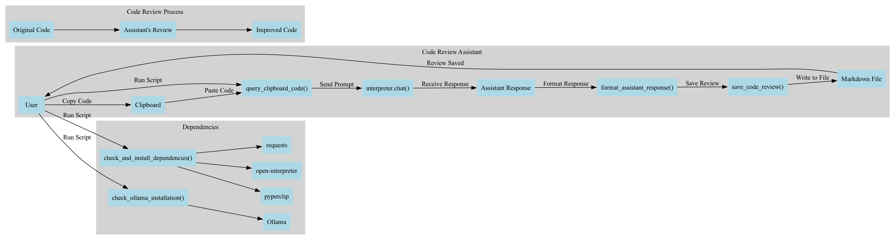

# Code Review Assistant Agent
We will demonstrate how to use the code review assistant. We will use open-interpreter which is an open-source project that allows an Large Language Model (LLM) to execute code in a Python environment. When we write code we don't want to have sources of failure. We want to have a code that is easy to read, easy to understand and easy to maintain. We will use the code review agent to help us achieve that.

First, we will need to install open-interpreter and edit the system prompt to make a code review assistant. We will then use the code review assistant to review the code we write.    

## File structure
.       
├── Makefile - Has shortcut commands to run common tasks         
├── README.md - This file       
├── code_review_assitant.py - The code review assistant script using open-interpreter & ollama      
├── code_reviews - The folder where the code reviews are saved      
│   ├── code_review_20250221_081632.md - sample code review     
│   ├── code_review_20250221_082037.md - sample code review     
│   ├── code_review_20250221_082226.md - sample code review       
│   ├── code_review_20250225_081526.md - sample code review               
├── docker - The folder that contains the docker files      
│   ├── Dockerfile.oi - The docker file for open-interpreter        
│   ├── Dockerfile.ollama - The docker file for ollama      
│   ├── README.md - The readme for the docker files             
│   ├── code_review_assitant.py - The code review assistant script using open-interpreter & ollama      
│   ├── docker-compose.yml - The docker compose file for open-interpreter & ollama      
│   └── requirements.txt - The requirements file for the docker files       
├── requirements.txt - The requirements file for the code review assistant script       
├── summary.dot - The dot file for the summary diagram for graphviz     
├── summary.png - The png file for the summary diagram for graphviz         
└── testing - The folder that contains the test files       
    ├── __init__.py - The init file for the testing folder to allow it to be imported as a module       
    ├── general_review_test.py - has examples for general software engineering practices        
    ├── ml_review_test.py - has examples for machine learning practices     
    └── test_input_validation.py - has examples for input validation        

## Installation
Make a virtual environment and install open-interpreter.

```bash
python3 -m venv venv
source venv/bin/activate
pip install open-interpreter
```

If you are using ollama you'll also need to do a system wide install

Steps to install ollama 
```bash
# curl will install the latest version of ollama
# -sSfL will make sure that the script is silent and fails on errors
curl -sSfL https://ollama.com/download.sh | sh
```

Install these recommended models. Start small then use larger models as needed.
```bash
# download the models
ollama pull qwen2.5-coder:0.5b #switch to 7B if you have enough memory (4.7GB)
ollama pull qwen2.5:0.5b
```
Once you have ollama installed, you can run the following command to start open-interpreter with ollama as the backend.

```bash
interpreter --local
```


## Usage
The py script will be able to download the requirements for you however, for the ollama step you will need to do it manually. 

The code review assistant is designed to only review actual programming code. It will reject non-code inputs such as plain text, data files, or configuration without code context.

Here's a diagram of how the code review assistant works.





Make the graph with the following command
```bash
python3 -m pip install graphviz
```

Edit the .dot file to your liking and run the following command
```bash
dot -Tpng summary.dot -o summary.png
```

## Running Tests

The project includes a suite of tests in the `testing` directory. These tests ensure that the code review assistant functions correctly. To verify if the inputs have been set up correctly. Run this command to see if the inputs are set up correctly.

```bash
python3 pytest testing/test_input_validation.py
```
The rest are individual code review tests.  

### Prerequisites

Make sure you have pytest installed (it's included in the requirements.txt):

```bash
pip install -r requirements.txt
```

### Running All Tests

To run all the test cases:

```bash
# Run from the project root directory
pytest testing/
```

### Running Specific Tests

To run specific test files:

```bash
# Run a specific test file
pytest testing/test_specific_file.py
```

### Troubleshooting Tests

If tests are failing, ensure:
1. All dependencies are correctly installed
2. Ollama is running (if the test requires it)
3. You have the required models pulled in Ollama
4. You are running the tests from the project root directory

## Contributing
Be sure to follow the code style and conventions used in the project. If you have any questions or suggestions, feel free to open an issue or submit a pull request.

## License
All code is licensed under the MIT License. See the [LICENSE](LICENSE) file for more information.

## Acknowledgements
This project is inspired by the need for better code review tools and the capabilities of Large Language Models. Special thanks to:

- The [open-interpreter](https://github.com/KillianLucas/open-interpreter) team for their work on this project
- [Ollama](https://ollama.com/) - a great tool for running LLMs locally
- [Qwen 2.5 coder](https://github.com/QwenLM/Qwen2.5-Coder) by the Alibaba team - helps run the code review assistant locally in resource constrained environments
- [pyperclip](https://github.com/asweigart/pyperclip) - for clipboard functionality


## Citation
If you use this code in your research, please cite it as follows:

```bibtex
@misc{code-review-assistant,
    author = {Shuyib},
    title = {Code Review Assistant using Open Interpreter and Ollama},
    year = {2025},
    publisher = {GitHub},
    journal = {GitHub Repository},
    howpublished = {\url{https://github.com/shuyib/code-review-assistant}},
    url = {https://github.com/shuyib/code-review-assistant},
    date = {2025-02}
}
```
